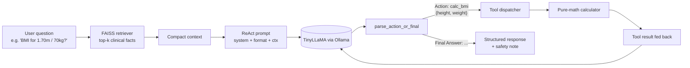

# clinical-ai-tool-agent

> A LangChain ReAct agent that reasons about patient vitals — deciding when to call clinical calculators (BMI, MAP, Anion Gap) versus when to retrieve from a local knowledge base. Runs entirely on a local TinyLLaMA via Ollama, with a transparent text-based tool-calling protocol because TinyLLaMA does not support native function calling.


## Origin

This project started as an exercise for FAU's COT 6930 (Generative AI & Software Development Lifecycles) course. The original notebook is preserved as [`notebooks/walkthrough.ipynb`](notebooks/walkthrough.ipynb) — the complete, exploratory version with the original model outputs intact. Everything else in this repo (the Python package, tests, CLI, and [`notebooks/demo.ipynb`](notebooks/demo.ipynb)) is a cleaner, packaged take I built afterwards to turn the exercise into something reusable.

## What this demonstrates

- **Agent design** — a ReAct loop (`Action` / `Action Input` / `Final Answer` text protocol) that works on small local models without native function calling.
- **Tool integration** — Pydantic-validated LangChain Tools wrapping pure-Python calculators, with deterministic outputs the LLM can quote back.
- **Local RAG** — a FAISS index over a small medical corpus, served by a `sentence-transformers/all-MiniLM-L6-v2` embedding model.
- **Safety design** — a system prompt that bounds the assistant to "educational use only" and a structured output template (Red Flags / Hypotheses / Next Steps / Safety Note) on every response.

## Tech stack

- [LangChain](https://www.langchain.com/) (`langchain`, `langchain-core`, `langchain-community`, `langchain-ollama`, `langchain-huggingface`, `langchain-text-splitters`)
- [Ollama](https://ollama.com/) — `tinyllama` for generation
- [FAISS-CPU](https://github.com/facebookresearch/faiss) — local vector index
- [Sentence-Transformers](https://www.sbert.net/) — `all-MiniLM-L6-v2` embeddings
- [Pydantic v2](https://docs.pydantic.dev/) for tool input validation
- Python 3.10+, [pytest](https://docs.pytest.org/)

## Architecture



## Quickstart

```bash
# 1. Install Ollama and pull the LLM
ollama pull tinyllama

# 2. Python env
python -m venv .venv
source .venv/Scripts/activate   # Windows: .venv\Scripts\activate
pip install -e .[dev]

# 3. Deterministic tests (calculators + parser + corpus)
pytest

# 4. Try the agent interactively
clinical-agent

# 5. Or open the demo notebook
jupyter lab notebooks/demo.ipynb
```

## Programmatic usage

```python
from clinical_ai_tool_agent.agent import build_default_llm, run_pipeline_react
from clinical_ai_tool_agent.knowledge import build_retriever
from clinical_ai_tool_agent.tools import build_tools

llm = build_default_llm()
retriever = build_retriever()
tools = build_tools()

trace = run_pipeline_react(
    "Patient height 1.68 m, weight 82 kg. Compute BMI and outline next steps.",
    llm=llm,
    retriever=retriever,
    tools=tools,
)

print("Tool calls:", trace.tool_calls)
print("Final:", trace.final_answer)
print(f"{trace.steps} step(s), {trace.latency_s}s")
```

## Sample interaction

```
> Given labs: Na 138, Cl 100, HCO3 22. Compute anion gap and outline interpretation.

Tool calls:
  - calc_anion_gap: Anion gap=16.0 (educational estimate)

--- Final Answer (2 step(s), 8.4s) ---
- Calculated Parameters: Anion gap ~ 16 mEq/L (educational estimate)
- Hypotheses: Within typical reference range; an elevated anion gap can
  suggest metabolic acidosis, but this requires clinical context.
- Next-Step Considerations: Confirm with a licensed clinician; consider
  ABG and clinical correlation if symptoms support it.
- Safety Note: Educational use only. Not medical advice.
```

## Why a text-based ReAct protocol (not native function calling)?

`ChatOllama` with TinyLLaMA does not implement native tool-calling. Rather than swap to a heavier model with `bind_tools()`, this project keeps everything on a small local model by using a strict text protocol:

```
Action: calc_bmi
Action Input: {"height_m": 1.75, "weight_kg": 70}
```

The `parse_action_or_final` function (~30 LOC, [src/clinical_ai_tool_agent/parser.py](src/clinical_ai_tool_agent/parser.py)) extracts the call. This is the same idea behind the original ReAct paper and what most pre-function-calling agents used. Pros: works on any model that can follow a format, easy to debug, no JSON-schema brittleness. Cons: occasional malformed outputs — handled by re-prompting up to `MAX_STEPS`.

## What I learned

The dominant failure mode on TinyLLaMA isn't bad math — the calculators always return correct values. It's the model occasionally emitting an `Action Input` with the wrong keys, or wrapping JSON in markdown fences. Lowering the temperature to 0.2, hard-coding the format example in the system prompt, and capping `max_tokens` at 512 cut the malformed-output rate substantially. The structured output template (Red Flags / Hypotheses / Next Steps) also helps — it gives the model "rails" to fill in rather than free-form prose.

## Project layout

```
clinical-ai-tool-agent/
├── src/clinical_ai_tool_agent/
│   ├── calculators.py    # pure math: BMI, MAP, anion gap
│   ├── corpus/corpus.md  # editable knowledge facts
│   ├── knowledge.py      # FAISS retriever
│   ├── tools.py          # LangChain @tool wrappers
│   ├── parser.py         # ReAct output parser
│   ├── prompts.py        # system prompt + safety disclaimer
│   ├── agent.py          # ReAct loop
│   └── cli.py            # interactive REPL
├── tests/                # calculators + parser + corpus tests
└── notebooks/
    ├── demo.ipynb        # quick library-usage example
    └── walkthrough.ipynb # original COT 6930 exercise, cleaned for portfolio use
```

---

**Part of my GenAI portfolio:**
[prompt-strategy-lab](../prompt-strategy-lab) · [rag-ablation-lab](../rag-ablation-lab) · [clinical-ai-tool-agent](.) · [mcp-research-collective](../mcp-research-collective)
